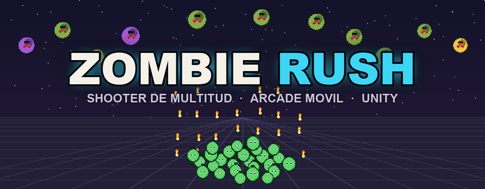

<p align="center">
  
</p>

<p align="center">
  
  
  
  
</p>

<p align="center">
  <b>Shooter de multitud arcade</b> para móvil. Controlas un <b>escuadrón</b> que se mueve
  lateralmente y dispara recto; creces cruzando <b>gates</b> y rescatando supervivientes
  mientras una horda de zombies te erosiona. Un dedo, sesiones de 1–3 min, portrait.
</p>

> Antes se llamaba *Zombie Dash* (un "dodge & shoot" de héroe único). El juego pivotó de
> género; el diseño completo está en `openspec/changes/pivot-zombie-rush/` y el juego anterior
> queda preservado en el tag de git **`pre-zombie-rush`**.

---

## ✨ Estado: jugable, productizado y con APK

El loop completo está implementado por código y **compila, construye e instala** en Android.
Todo el arte, audio, UI e iconos se **generan por código** (sin assets binarios → sin Git LFS).

**Jugabilidad**
- 🪖 **Escuadrón-multitud**: formación disco (ancho ∝ √N), movimiento en X, disparo recto por
  *streams* con daño por densidad. El escuadrón **crece de uno en uno** al cruzar gates/jaulas.
- 🛣️ **Recorrido con scroll**: hordas densas, **gates en carriles** (+ / × / trampa / arma),
  **jaulas** de supervivientes y **barreras** destructibles.
- 🧟 **Combate 1:1**: cada zombie que llega al frente mata 1 soldado (escudo frontal emergente).
  Variedad de tipos (normal, *runner* rápido, *tank* pesado). Derrota a 0; victoria al completar.
- 🗺️ **100 niveles** generados proceduralmente (deterministas, fijos), con **jefe cada 10** y
  mecánicas introducidas poco a poco.
- 🛒 **Meta-tienda = punto de partida**: soldados iniciales y arma base (tiers), con monedas del banco.

**Presentación (todo procedural)**
- 🎨 **Sprites animados** (marcha/disparo del soldado, *shamble* de zombie, jefe dedicado) y
  **entorno**: cielo en degradado, suelo con carriles que hacen scroll y props en parallax.
- 💥 **Juiciness**: fogonazos, *gore*, *hit-stop*, *pop* de escala, confeti, *screen shake*, números de daño.
- 🖥️ **UI** con look neón (HUD con iconos, menú/tienda, **pausa**, **ajustes**, tutorial), fundidos entre escenas.
- 🔊 **Audio** sintetizado por código (música por estado menú/juego/jefe + SFX) y **vibración**.
- 📱 **Productización**: **icono** y **splash** de app generados por código.

## ▶️ Cómo abrirlo y jugar

1. Abre **Unity Hub → la carpeta** (Unity 6000.4.9f1). Al abrir, Unity compila y genera los `.meta`.
2. Abre **`Assets/Scenes/MainMenu.unity`** (menú + tienda) o **`Game.unity`** (directo) y pulsa
   **Play** en vertical 9:16.
3. **Arrastra** para mover el escuadrón. Alinéate con los gates buenos, rescata jaulas, derriba
   barreras y sobrevive a la horda hasta el final del nivel.

## 📦 Compilar APK (CLI)

```bash
/Applications/Unity/Hub/Editor/6000.4.9f1/Unity.app/Contents/MacOS/Unity \
  -quit -batchmode -nographics -projectPath "$(pwd)" \
  -buildTarget Android -executeMethod BuildAndroid.BuildAPK -logFile -
```
Genera `Builds/ZombieRush.apk` (IL2CPP+ARM64, portrait, package `com.luismiguel.zombierush`),
con **ambas escenas** (menú + juego) e **icono/splash**. Instalar: `adb install -r Builds/ZombieRush.apk`.
También desde el editor: menú **Zombie Rush → Build APK (Android)**.

## 🧱 Arquitectura (code-first)

Cada escena se monta por código desde su *bootstrap* (un único GameObject): `GameBootstrap` (Game)
y `MenuBootstrap` (MainMenu). Nada se cablea en el Inspector. Scripts en `Assets/Scripts/`:

| Script | Responsabilidad |
|---|---|
| **Core** | |
| `Core/GameBootstrap` · `MenuBootstrap` | Montan la partida / el menú por código. |
| `Core/GameManager` | Estado de la run, nivel, tier de arma, victoria/derrota (singleton). |
| `Core/Campaign` · `Economy` · `StartingPoint` | Persistencia (PlayerPrefs): nivel, banco, punto de partida. |
| `Core/LevelGenerator` · `LevelDefinition` · `LevelRunner` | Genera y reproduce los 100 niveles (scroll + encuentros + jefe). |
| `Core/Weapons` · `Prims` · `SettingsStore` | Arma por tiers · fábrica de sprites · ajustes (música/sfx/vibración). |
| **Player / Combat / Enemies** | |
| `Player/Squad` · `SquadShooter` | Escuadrón-multitud (recuento, formación √N, crecimiento, erosión) y disparo. |
| `Combat/Bullet` · `IShootable` · `Gate` · `Cage` · `Barrier` | Proyectil con pool y elementos del recorrido. |
| `Enemies/Enemy` | Zombie: baja hacia el escuadrón; contacto 1:1; tipos y jefe. |
| **Presentación (FX / UI)** | |
| `FX/PixelArt` · `SpriteAnim` | Sprites pixel-art por código y animación por frames. |
| `FX/Environment` | Cielo, suelo con scroll, props en parallax, viñeta. |
| `FX/Vfx` · `HitEffect` · `CameraShake` · `FloatingTextManager` | Juiciness: fogonazo, gore, hit-stop, pop, confeti, shake, daño. |
| `FX/Sfx` · `Music` · `Haptics` | Audio sintetizado y vibración. |
| `UI/UiKit` · `Hud` · `MenuUI` · `PauseMenu` · `SceneFade` | UI IMGUI con look neón, HUD, menú/tienda, pausa, fundidos. |
| **Editor** | |
| `Editor/BuildAndroid` · `AppIconGen` | Build del APK e icono/splash generados. |
| `Editor/ZombieDashSetup` · `CreateGameData` | Regeneran escenas / datos (menús *Zombie Rush*). |

> Dormantes del juego anterior (compilan, sin uso): `Player/PlayerController`,
> `Enemies/EnemySpawner`, `Combat/Pickup`, `Core/Upgrades`, `Data/*`.

## 🚀 Siguientes pasos

- Seguir **tuneando balance** (curvas D/G, valores de gates, densidad de hordas).
- Migrar UI de IMGUI a **uGUI** (opcional; la arquitectura ya lo permite).
- Publicación en **Google Play** (firma, ficha, testing cerrado).

## 🛠️ Notas técnicas

- Unity **6000.4.9f1**, 2D, Built-in RP, Android **portrait**.
- Arte/audio/UI **100 % procedurales** (generados por código, sin archivos binarios).
- Desarrollo guiado por specs con **OpenSpec** (`openspec/`).
